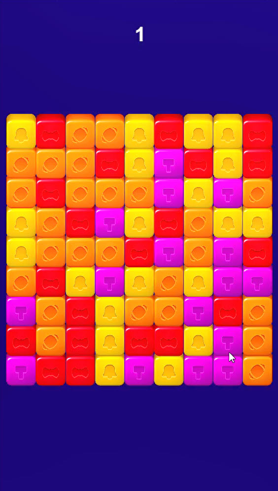

# Project Name: Match Three

Welcome to the Match Three Gameplay Mechanics project! This open-source game draws inspiration from the gameplay mechanics of ToonBlast. It aims to provide a delightful match-three gaming experience while promoting code readability and modularity.

## Features

- **Dynamic Board Game Size:** The project offers a dynamic board game size, allowing for flexible and varied level designs.

- **Separation of Logic, Data, and UI:** The project emphasizes code organization by separating game logic, data management, and user interface components.

- **Handcrafted Code:** The entire project is built from scratch without utilizing any AI components. Each line of code is meticulously crafted to ensure control and understanding of the mechanics.

- **Level Manager:** The project includes a Level Manager that loads level properties from a JSON file in the Resource folder. This feature enables easy expansion and customization of the game's levels.

## Getting Started

To get started with the Match Three Gameplay Mechanics project, follow these steps:

1. Clone the repository: [git clone](https://github.com/afraism/Match-3.git)

2. Open the project in Unity 2020.3.30 or a compatible version.

3. Build the project and ensure all dependencies, including the DoTween package, are properly imported.

4. Explore the codebase to understand the structure and interaction between different components.

5. Run the game and enjoy playing!

## Contributing

Contributions to the Match Three Gameplay Mechanics project are welcome! If you have suggestions for improvements, bug fixes, or additional features, please open an issue or submit a pull request. Together, we can make this project even better!

When contributing, please adhere to the following guidelines:

- Clearly describe the purpose of your contribution in the pull request or issue.

- Follow the existing coding style and naming conventions for consistency.

- Write clear and concise commit messages to track changes effectively.

## Future Plans

The Match Three Gameplay Mechanics project is an ongoing effort, with future plans including:

- Implementation of a pooling pattern for optimized object creation and reuse.

- Introduction of power-ups and special objects to add depth and strategic gameplay elements.

- Addition of sound and visual effects for a more immersive gaming experience.

- Incorporation of social and online features, such as leaderboards and multiplayer functionality.

- Localization support to make the game accessible to a wider audience.

## Acknowledgements

The Match Three Gameplay Mechanics project would like to acknowledge:

- The developers and designers of ToonBlast for inspiring this project.

- The open-source community and online developer communities for their valuable contributions and assistance.

- The creators of libraries and frameworks used in the project for their reliable tools, including the DoTween package.

Thank you for choosing the Match Three Gameplay Mechanics project! We hope you enjoy playing and welcome your contributions and suggestions to make the project even better.

## Preview Video

Please click on the image above to watch a preview video of the gameplay.

## Developer

[AFRA](https://github.com/afradigm)

